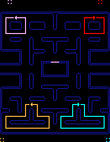

# Pac-Man Kata

Hi Dojers,
this Kata is obviously inspired by the great game of Pac-Man (Namco 1980), yet the task is not about creating a real-time game.
All state changes (moving, eating and so on) will be made in discrete steps (ticks), like in the GameOfLife Kata.
We assume that the Pac-Man and ghosts move one field on each tick. The Kata is strictly oriented on improving your OOP skills, it is not about game development.

The Kata has 3 levels of advancement: junior, mid and senior.
Each level introduces new features and twists.
Start with the junior level and finish it, then move to the next level. Remember about testing, a level is completed, if only all relevant tests are green!

The boilerplate for this Kata contains the visualisation for the game state, but use it for debbuging purposes.
This Kata's task is about good OOP programming and testing, the visualisation is not crucial.

## Junior level

Create the Pac-Man class, that...
- has the following attributes:
	- lives,
	- points,
	- level,
	- ball count,
	- ghost count,
	- state,
	- super time;
- has the `tick` method, which updates Pac-Man state in each step (more functionality will be added here later);
- has an `eat ball` method that takes a ball (either _regular_ or _super_) as an argument, and adds 1 to the `points` attribute when eating a ball:
	- each time a ball is eaten, `points` and `ball count` should each increase by 1,
	- if the `ball count` reaches 40, `level` should be increased by 1 and `ball count` should be reset to 0,
	- if the ball is of ball type _super_, the Pac-Man `state` should change to _super_ and set `super time` to 10,
	- if the Pac-Man state is _super_, `super time` should be decreased by 1 on each tick (if zero then return to the _regular_ state);
-  has an `eat ghost` method that takes a ghost name (i.e. Blinky, Pinky, Inky and Clyde) as an argument:
	- if the Pac-Man state is _super_ eating a ghost should increase `points` by 10,
	- if the Pac-Man state is not _super_, eating a ghost should decrease `lives` by 1,
	- if the Pac-Man has zero `lives` left, eating a ghost should reset `points` to zero,
	- eating a ghost should increase the total `ghost count` by 1;
- `ghost count` should store statistics for each ghostsas well as the total number of eaten ghosts.

Don't be afraid of changing names, naming things is super important. **Remember, be TDD-ish!** Go do some tests now!

## Mid level

Now, do some extra features:
- the Pac-Man is now on a `grid` (a map, level) filled with dots (eventually empty spaces if dots are already eaten),
- the Pac-Man...
	- has a `direction`,
	- `moves` on each tick (discrete steps by one square),
	- can be rotated by an user (the direction changing, we've implmented a very simple events handling in the file `index.ts`),
	- eats dots on the way,
	- stops on wall,
	- will not rotate into a wall;
- add the `ghost` class, which has also a position, direction and moves on each step,
- add a collision detection between ghosts and the Pac-Man.

**Remember, be TDD-ish!** Go do some tests now!

## Senior level

So far, the Pac-Man should be able to move and an user can control him. Now, it's time for the ghosts' AI.
There are two modes for ghosts' AI: _scatter_ and _chase_.
Each ghost is in the _scatter_ mode for 7 ticks, then it starts the _chase_ mode for the next 20 ticks and after that starts again in the _scatter_ mode.

In the _scatter_ mode, the ghosts will stop chasing Pac-Man and each will move into its respective corners. See the following image:



In the _chase_ mode, the ghosts are trying to find and capture Pac-Man.
Each of the four ghosts has a unique behaviour while chasing Pac-Man.
Blinky the red ghost is very aggressive in its approach while chasing the Pac-Man and will follow the Pac-Man once located.
Pinky the pink ghost will attempt to ambush Pac-Man by trying to get in front of him and cut him off.
Inky the cyan ghost will patrol an area and is not very predictable in this mode.
Clyde the orange ghost is moving in a random fashion and seems to stay out of the way of Pac-Man.

Be brave and interpret the exact ghosts' algorithms as you want to. The senior level already know that TDD is a must.

## Commands

- `npm test` to execute your test cases,
- `npm run dev` to run the development server on the port 1234,
- `npm run build` to build the production code in the folder `dist` (without starting a server).

## Visualisation

The Pac-Man's visualisation is a very simple code, that takes the current state as an argument and displays it on the HTML5canvas.
The state has the following interface:
```
interface PacManState {
    pacman: [number, number, string]; // [x, y, direction]
    blinky: [number, number, string]; // [x, y, direction]
    pinky: [number, number, string]; // [x, y, direction]
    inky: [number, number, string]; // [x, y, direction]
    clyde: [number, number, string]; // [x, y, direction]
    map: [number, number, number[][]];  // [width, height, [the map data, where 0 means a wall, 1 an empty field, 2 a small dot and 3 a super dot]]
    // Pac-Man's statistics from the class
    lives: number,
    points: number,
    level: number,
    ballCount: number,
    ghostCount: {
        total: number,
        blinkyCount: number,
        pinkyCount: number,
        inkyCount: number,
        clydeCount: number
    },
    state: string,
    superTime: number
};
```
The example:
```
const testState: PacManState = {
    pacman: [0, 0, 'down'],
    blinky: [1, 0, 'up'],
    pinky: [2, 0, 'left'],
    inky: [3, 0, 'right'],
    clyde: [4, 0, 'up'],
    map: [5, 6,  [
        [1, 1, 1, 1, 1],
        [1, 0, 2, 0, 1],
        [1, 1, 2, 0, 1],
        [1, 0, 2, 2, 1],
        [1, 0, 0, 3, 0],
        [1, 1, 2, 2, 0]
    ]],
    lives: 3,
    points: 10,
    level: 1,
    ballCount: 6,
    ghostCount: {
        total: 4,
        blinkyCount: 1,
        pinkyCount: 2,
        inkyCount: 0,
        clydeCount: 1
    },
    state: 'regular',
    superTime: 0
};
```
See how to use that example in the `index.ts` file.

## Credits

Author of this Kata: [Arek Nowakowski](https://www.linkedin.com/in/arkadiusz-nowakowski-040723122/).
Inspirations: [codingdojo.org](http://codingdojo.org/kata/PacMan/) and [codewars.com](https://www.codewars.com/kata/pacman/ruby).
The ghosts' AI description can be found [here](https://dev.to/code2bits/pac-man-patterns--ghost-movement-strategy-pattern-1k1a) and [here](https://gameinternals.com/understanding-pac-man-ghost-behavior).
The spritesheet for Pac-Man: [https://github.com/rm-hull/big-bang/tree/master/examples/pacman](https://github.com/rm-hull/big-bang/tree/master/examples/pacman)

